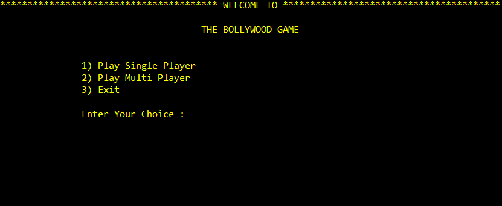
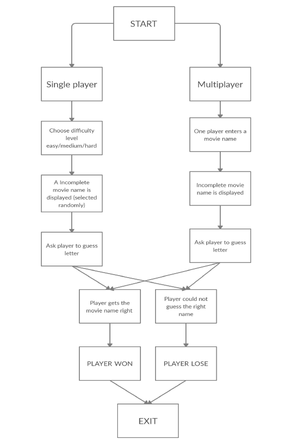

# Bollywood Game 🎞️

## Abstract

In this project we have made the game of bollywood where single
player and multiplayer options are available.
The movies will be displayed such that only the vowels in the
spelling of movie will be displayed and the rest of the letters will be
shown as dash ( _ ). The player has to guess the letter that will
replace the dash. If that letter is in the name(s) then the project will
write the letter at everyplace it appears.
The word **B O L L Y W O O D** will be displayed at the top of the
screen which actually shows the user the no. of chances left. If a
person guesses a wrong letter then a letter for BOLLYWOOD will
be removed and displayed as such **/ O L L Y W O O D** and this pattern continues. If the user makes a
total of 9 wrong guesses they will lose.

This project is made using **C++**. 

## Installation

Clone the repository to your system and run bollywoodgame.cpp file on codeblocks IDE.

## Flowchart

## Future Work

This game currently lacks an attractive and easy to use GUI in future work that
could be done to make game more attractive and user friendly. This game can have
varied applications in the context of word formations and puzzles. Its knowledge
can be valuable to many other games like CROSSWORD PUZZLES, WHEEL OF
FORTUNE, SCRABBLE.We can also have an investigation of very popular and
commonly used letters in most of the words. Make a frequency distribution in
graph out of it. The underlying mathematical concepts are Data Collection and
Analysis, Presentation and Interpretation which can have lot of implications in
language processing and study of graphs and testing conjectures. 
